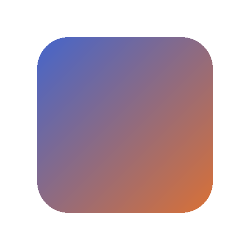

# img2dots

Convert an image into Markdown-embedded LaTeX `\rule` dots — every pixel becomes a colored dot, and the whole picture is rendered as a contiguous grid inside a single inline `$ … $` block.

The output is a Markdown file. Viewed in a LaTeX-capable Markdown renderer (MathJax / Obsidian), the dots line up into the original image.

## Example

Input image — [`examples/square.png`](examples/square.png) (a rounded gradient square on a transparent background):



Generated with:

```
img2dots examples/square.png -o examples/square.md
```

Output — [`examples/square.md`](examples/square.md). It is one long inline-math line that looks like this:

```latex
$\phantom{\rule{1pt}{1pt}}…\textcolor[RGB]{80,105,199}{\rule[21pt]{1pt}{1pt}}…$
```

Open `examples/square.md` in MathJax / Obsidian to see it as the square. The transparent
background is skipped automatically, so the square appears on an empty canvas.

> **Rendering note:** the output relies on MathJax features (negative `\hspace`, raised `\rule`).
> It is designed for MathJax / Obsidian and does **not** render correctly with KaTeX or GitHub's
> native Markdown math.

## Installation

Requires Python 3.10+. Install from a clone of this repository:

```
pip install .
```

For development (editable install plus the test dependency):

```
pip install -e ".[dev]"
```

This installs the `img2dots` console command. There is no PyPI release yet.

## Usage

```
img2dots INPUT -o OUTPUT [options]
```

`INPUT` is the image to convert and `-o/--output` is the Markdown file to write. The equivalent
module form works too:

```
python -m img2dots INPUT -o OUTPUT [options]
```

## Options

| Option | Default | Description |
| --- | --- | --- |
| `INPUT` | — | Path to the input image (required). |
| `-o`, `--output` | — | Path to the Markdown output file (required). |
| `--max-size` | `64` | Maximum edge length in pixels; the image is scaled down to fit. |
| `--dot-size` | `1.0` | Dot edge length in pt. |
| `--raise` | `0.0` | Vertical offset of the image in pt; 0 centers it on the line, positive lifts it. |
| `--alpha-threshold` | `50` | Minimum opacity in percent (0–100) for a pixel to be drawn; fainter pixels are skipped. |
| `--version` | — | Print the version and exit. |

## License

Released under the [MIT License](LICENSE).
